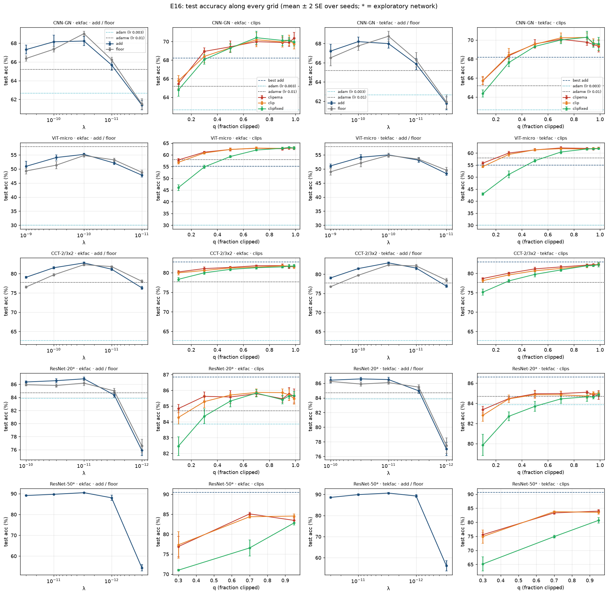
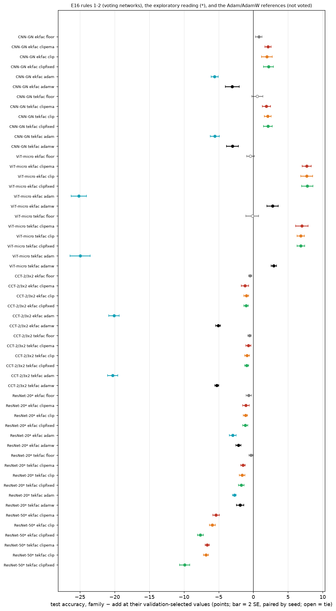
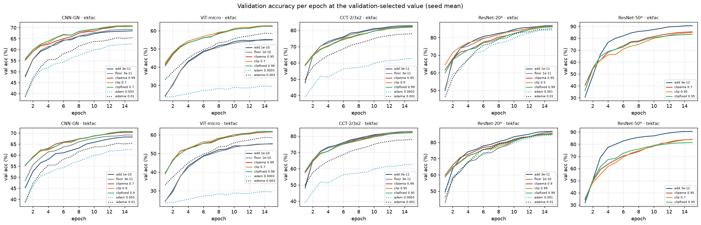
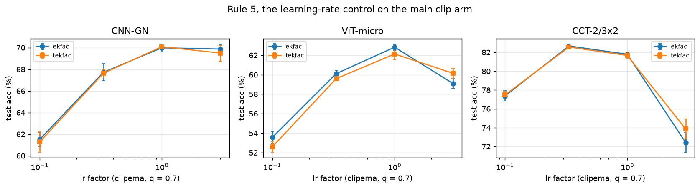
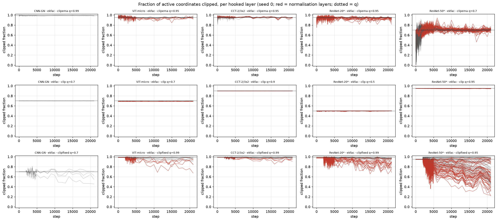
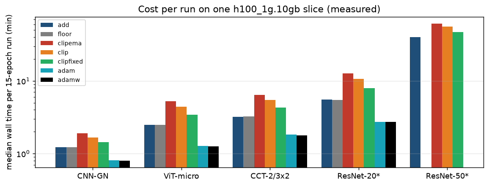

# E16 — results: a floor or a clip instead of the added safety constant

*All runs of E16 are in: the three voting networks (5 seeds, both modes, 30 (network, seed, mode)
files) and the two exploratory ResNets (ResNet-20: 5 seeds, full design; ResNet-50: 3 seeds, reduced
design on its calibrated grid). The verdicts below are those of the pre-registered script
`fisher_ref/experiments/e16_decisions.py`, run unmodified on the 46 merged files. The tables and
figures come from `fisher_ref/experiments/e16_report.py`; every cell is listed in
[`e16_results_tables.md`](e16_results_tables.md). The plan and the rules are in
[`plan_floor_clip.md`](plan_floor_clip.md) and `plan_lambda_dominance.md`, section E16.*

---

## Short version

- **The run is valid.** The decision script found no defect in any of the 46 files. At seed 0
  every determinism check is bit-identical, and so is the inertness check on `cnn_gn_cifar`. The
  repro diagnostic reproduces E14/E13/E10's stored cell bit for bit on all four networks that have
  one.
- **Rule 3 gives "mixed" for all four families.** The clips win clearly on two voting networks and
  lose on the third:

  | network | clips − add (test, points) | floor − add |
  |---|---|---|
  | `cnn_gn_cifar` | **+1.9 to +2.2**, win in 6 of 6 | +0.79 win (`ekfac`), +0.56 tie (`tekfac`) |
  | `vit_micro_cifar` | **+6.8 to +7.8**, win in 6 of 6 | tie, tie |
  | `cct_2_3x2_cifar` | **−0.7 to −1.2**, lose in 6 of 6 | −0.45, −0.56: lose, lose |

- **Rule 4: no value transfers,** neither `q` for any clip nor `λ` for `add` or the floor. For the
  clips the reason is not that the curves differ in shape. On every voting network, all three
  clips sit within about 1 point of their best for q between 0.7 and 0.99. But the one-SE plateaus
  are narrow (standard errors of 0.1-0.4 point) and do not share a common value.
- **Rule 5: the lr control qualifies `clipema` on `cct_2_3x2_cifar`.** There, lr/3 beats lr by
  +0.89 and +0.90 (win in both modes). The CCT loss is therefore at least partly a learning-rate
  effect, not a verdict on clipping.
- **Rule 6: the three thresholds are interchangeable.** `clipema − clip` and `clipfixed − clipema`
  tie in 10 of 12 (network, mode) pairs. The two exceptions are on `cct_2_3x2_cifar`/`tekfac`,
  both at about 0.2 point.
- **Exploratory: the clip is not robust on the ResNets.** It loses to `add` in both modes on both
  networks. On ResNet-20 the loss is −1.1 to −1.7 points (5 seeds). On ResNet-50 it is −5.4 to
  −9.9 points (3 seeds), largest for `clipfixed`. The floor loses on ResNet-20 as well (−0.35 to
  −0.66).
- **Against Adam/AdamW at the same protocol** (`e16_baselines.py`, lr = benchmark `baseline_lr` x
  {1/3, 1, 3, 10, 30}, selected on validation, 5 seeds): the clip beats the better baseline on
  every network it was run on, by **+5.2 / +4.9** (CNN-GN), **+4.9 / +4.0** (ViT-micro),
  **+3.9 / +4.6** (CCT) and **+1.1 / +0.4** (ResNet-20, the second a tie). The comparison with the
  tuned λ and the per-layer λ is in [`e16_vs_lambda.md`](e16_vs_lambda.md), where the one loss
  against AdamW is E14's tuned λ on ViT-micro (−2.7). Two things to keep in mind: the benchmark's
  `baseline_lr` was tuned at batch 128 and is 10-30x too small here, so the first grid understated
  AdamW by 1.3 to 8 points; and AdamW on ViT-micro is still at the top of the extended grid
  (58.0 % at x30, rising by 1.6 over x10), so its number there is a lower bound. ResNet-50's
  baselines are still running.
- **For E17:** no clip and no floor qualify as a candidate. The `add` candidate is the geometric
  mean of the six selected `λ`, 5.5e-11.

---

## 1. The state of the jobs

| network | shard jobs | merges | shard wall time (min) | limit | checkout, commit |
|---|---|---|---|---|---|
| `cnn_gn_cifar` | 30 COMPLETED | 10 | 17.9-20.7 | 0:35 | `new_adafisher_e16`, `7663d62` |
| `vit_micro_cifar` | 30 COMPLETED | 10 | 43.8-49.2 | 1:15 | same |
| `cct_2_3x2_cifar` | 30 COMPLETED | 10 | 53.9-64.0 | 1:30 | same |
| `resnet20_cifar` | 30 COMPLETED | 10 | 101.2-113.3 | 2:30 | `new_adafisher_e16_resnet`, `672adfe` |
| `resnet50_cifar` | 30 COMPLETED | 6 | 94.8-158.9 | 4:00 | `new_adafisher_e16_r50`, `d833a51` |

- No job failed or timed out. The CANCELLED entries in `sacct` are the pending batch cancelled
  by hand on 2026-09-21 to reorder the queue; every triple they belonged to was resubmitted.
- Each network comes from one commit, which is what the decision script requires.
- Two reproductions came free:
  - E16's seed-0 ResNet-50 `add` cells equal the calibration's (`e16c_*`, two days apart, another
    commit) on test accuracy, validation curve, distance travelled and step count: **10 of 10
    cells bit-identical**.
  - The repro diagnostic equals E14's stored cell on all 8 (network, mode) pairs that have one.

## 2. Figures

**Every grid** (`figures/e16/grids_test_acc.png`). Left: test accuracy against `λ` for `add` and the
floor. Right: against q for the three clips, with `add`'s best as a dashed line.

**Every paired comparison** (`figures/e16/forest_family_minus_add.png`). Each family minus `add`,
both at their validation-selected values, paired by seed, with bars at 2 standard errors. An open
marker is a tie.

**Validation accuracy along training at the selected values** (`figures/e16/val_curves_chosen.png`).

**The learning-rate control of rule 5** (`figures/e16/lr_control.png`): `clipema` at q = 0.7, with
the learning rate multiplied by 0.1, 1/3, 1 and 3.

**What the clip does per layer** (`figures/e16/clipped_fraction_per_layer.png`): the fraction of
active coordinates clipped, at seed 0 with `ekfac`, at the selected q. Normalisation layers are in
red.

**Cost** (`figures/e16/cost_per_run.png`): the median wall time of one 15-epoch run on a 1g slice,
per arm.

## 3. Observations, measured, not interpreted further

- **The clips lead after epoch 1 on every network; where they lose, `add` overtakes early.** This
  is the validation-accuracy gap, clip minus `add` (seed mean, both at their selected values):

  | network | epoch 1 | epoch 2 | epoch 5 | epoch 15 |
  |---|---|---|---|---|
  | `vit_micro_cifar` | +14.7 to +18.3 | +15.9 to +17.4 | +7.7 to +9.6 | +6.3 to +7.5 |
  | `cnn_gn_cifar` | +7.5 to +10.3 | +3.6 to +6.7 | +0.9 to +4.3 | +2.1 to +2.5 |
  | `cct_2_3x2_cifar` | +9.4 to +11.0 | −0.6 to +0.4 | −0.6 to −2.3 | −0.7 to −0.9 |
  | `resnet20_cifar`\* | +9.2 to +14.7 | −0.4 to +3.6 | −0.7 to −4.9 | −0.4 to −1.7 |
  | `resnet50_cifar`\* | +2.2 to +9.8 | −1.9 to +6.4 | −9.3 to −15.2 | −5.1 to −9.2 |

  The final-epoch validation gap is the quantity rule 1 selects on. Rule 2 is read on test
  accuracy, so the two differ slightly from the table of the short version.
- **`quantile` and `ema` hold their clipped fraction at q; `fixed` does not.** By construction
  `clip` sits on q exactly and `clipema` close to it. After its threshold is frozen at step 2 000,
  `clipfixed`'s clipped fraction drifts *down* on normalisation layers, as read from the
  figure at seed 0. It goes to about 0.7-0.95 on the ViT, CCT and ResNet-20, and to about 0.2-0.6
  on ResNet-50's BatchNorm layers. ResNet-50 is where
  `clipfixed` loses most (−7.6 and −9.9). The drift direction was pre-registered as "not predicted".
- **ResNet-50's `λ` curve is steep on the small side.** Over 3 seeds, `add` (`ekfac`, test %) goes
  89.09 → 89.68 → **90.46** → 88.00 → 54.38 for `λ` = 3e-11 … 3e-13; `tekfac` is the same to within
  2 points. The calibration had shown the same cliff at seed 0.
- **Prediction check** (§6 of the plan):
  - "The floor ties everywhere, within 0.5 point": **wrong in both directions.** It wins +0.79 on
    `cnn_gn_cifar`/`ekfac`, and loses −0.35 to −0.66 on CCT and ResNet-20.
  - "Chosen q in 0.5-0.9": 12 of the 18 voting clip selections are 0.7-0.95, and 6 are 0.99;
    none is below 0.7.
  - "clipema and clip within one seed floor": confirmed (rule 6).
  - "The clip ties with add on ResNet-20": **refuted.** It loses by 1.1-1.7 points.

## 4. What the comparison holds fixed, and what it does not

These are properties of the pre-registered design, recorded in `plan_floor_clip.md` §4. They are
restated here because they bear on how the table above can be read.
- **The clip arms run at `lr = 1e-3`, `add` and the floor at `lr = cap · λ`.** So the step-size cap
  differs by construction: a clipped coordinate moves by exactly `lr`. Rule 5 probes this, but on
  `clipema` at q = 0.7 only.
- **The clip arms freeze the parameters no hooked module owns** (`pos_embed` on ViT and CCT,
  `cnn_gn_cifar`'s GroupNorm). They also run with no weight decay where it is decoupled (ViT, CCT).
  In `add` both are frozen and switched off in effect, because `lr = cap · λ ~ 1e-10`. The ResNets
  have neither: every parameter is hooked, and their decay is coupled and kept in every arm.
- **Every arm uses `norm_exact_rescaling`.** That covers the 19 and 53 BatchNorm layers of the two
  ResNets, and the LayerNorms of ViT and CCT.
- **One seed floor per network.** Voting networks have 5 seeds, so a "win" at 2 SE rests on 4
  degrees of freedom. ResNet-50 has 3 seeds, i.e. 2 degrees of freedom.
